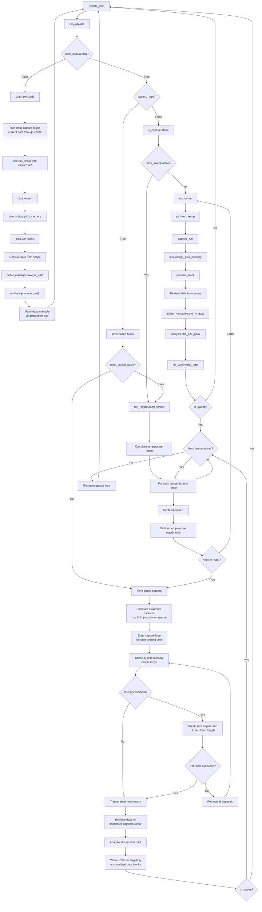

```mermaid
flowchart TB
    %% Main entry point - positioned at the top
    A[update_loop] --> B[run_capture]
    B --> C{user_capture flag?}
    
    %% LiveView path
    C -->|False| D[LiveView Mode]
    D --> D1[Run small capture to get\ncurrent data through scope]
    D1 --> D2[pico.run_setup with captures=2]
    D2 --> D3[capture_run]
    D3 --> D4[pico.assign_pico_memory]
    D4 --> D5[pico.run_block]
    D5 --> D6[Retrieve data from scope]
    D6 --> D7[buffer_manager.save_lv_data]
    D7 --> D8[analysis.pha_one_peak]
    D8 --> D9[Make data available\nvia parameter tree]
    D9 --> A
    
    %% Capture mode decision
    C -->|True| E{capture_type?}
    
    %% n_capture path (left side)
    E -->|False| F[n_capture Mode]
    F --> F0{temp_sweep active?}
    F0 -->|No| F1[n_capture]
    F1 --> F2[pico.run_setup]
    F2 --> F3[capture_run]
    F3 --> F4[pico.assign_pico_memory]
    F4 --> F5[pico.run_block]
    F5 --> F6[Retrieve data from scope]
    F6 --> F7[buffer_manager.save_lv_data]
    F7 --> F8[analysis.pha_one_peak]
    F8 --> F9[file_writer.write_hdf5]
    F9 --> F10{In_sweep?}
    F10 -->|Yes| T6
    F10 -->|No| A
    
    %% Time-based path (right side)
    E -->|True| G[Time-based Mode]
    G --> G0{temp_sweep active?}
    G0 -->|No| G1[Time-based capture]
    G1 --> G2[Calculate maximum captures\nthat fit in picoscope memory]
    G2 --> G3[Enter capture loop\nfor user-defined time]
    G3 --> G4[Check system memory\ncan fit arrays]
    G4 --> G5{Memory sufficient?}
    G5 -->|No| G10[Trigger abort mechanism]
    G5 -->|Yes| G6[Create new capture run\nof calculated length]
    G6 --> G8{User time exceeded?}
    G8 -->|Yes| G10[Trigger abort mechanism]
    G8 -->|No| G7[Retrieve all captures]
    G7 --> G4
    G10 --> G10a[Retrieve data for\ncompleted captures so far]
    G10a --> G11[Analyze all captured data]
    G11 --> G12[Write HDF5 file targeting\naccumulated data blocks]
    G12 --> G13{In_sweep?}
    G13 -->|Yes| T6
    G13 -->|No| A
    
    %% Temperature sweep path (middle)
    F0 -->|Yes| T[run_temperature_sweep]
    G0 -->|Yes| T
    T --> T1[Calculate temperature range]
    T1 --> T2[For each temperature in range]
    T2 --> T3[Set temperature]
    T3 --> T4[Wait for temperature stabilisation]
    T4 --> T5{capture_type?}
    T5 -->|False| F1
    T5 -->|True| G1
    
    %% Loop for temperature sweep
    T2 --> T6{More temperatures?}
    T6 -->|Yes| T2
    T6 -->|No| T7[Return to update loop]
    T7 --> A

```